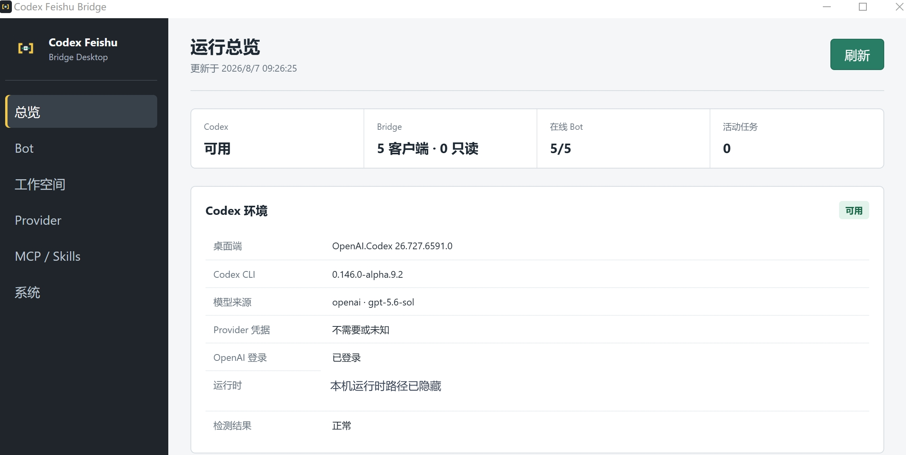
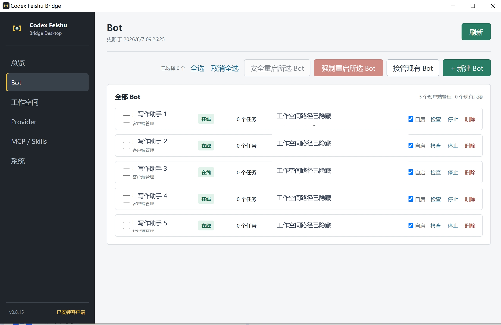
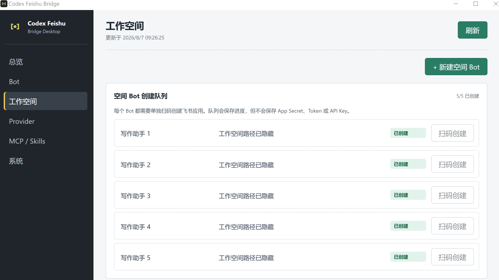
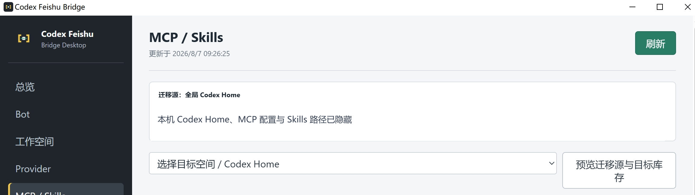
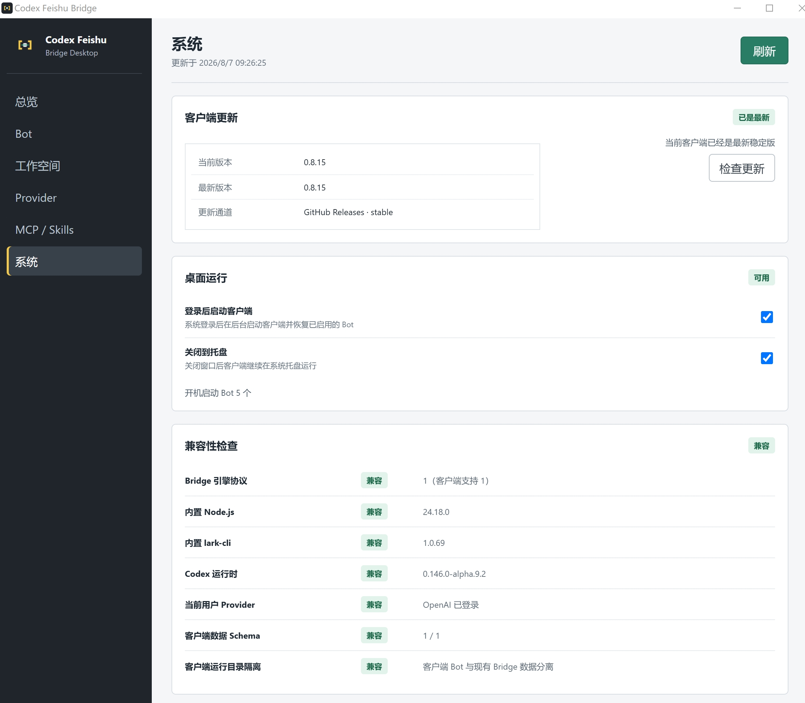
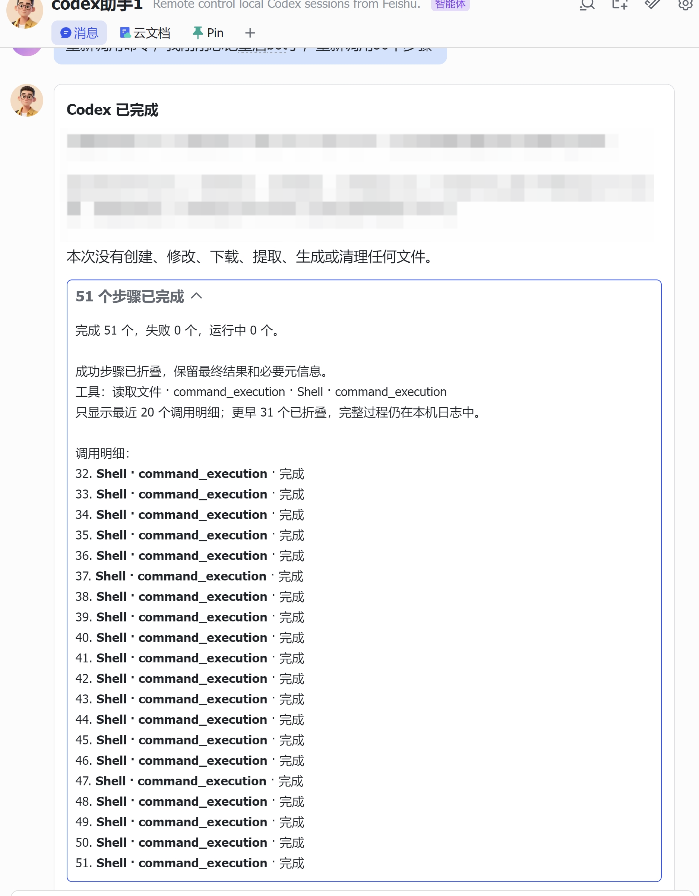

# Codex 飞书 Bridge

把飞书 Bot 接到本机 Codex。桌面客户端负责安装运行环境、创建或接管 Bot、管理工作空间与 Provider，并把飞书消息交给本机 `codex app-server`；任务进度、工具调用和最终结果会回写到飞书。

> 这是个人本机部署工具，不是云端托管服务。仓库只保存代码、示例配置和公开文档；真实密钥、飞书 profile、运行日志、二维码、会话状态和本机实例配置不会提交。

## 推荐安装方式

Windows 用户从 [GitHub Releases](https://github.com/yuanzhejiang669-jpg/codex-feishu-bridge/releases) 下载最新的 `Codex Feishu Bridge Setup.exe` 并安装。客户端已内置 Node.js、lark-cli 和 Bridge 引擎，不需要先运行仓库里的 PowerShell 部署脚本。

安装后：

1. 打开 **Codex Feishu Bridge**。
2. 在“系统”页确认 Codex、内置运行时和兼容性检查正常。
3. 在“Bot”页新建 Bot，或接管已有脚本部署的 Bot。
4. 需要多个垂类 Bot 时，在“工作空间”页创建队列并逐个扫码。
5. 第三方模型在“Provider”页添加并实测，再分配给 Bot 或空间。

客户端可在“系统 -> 客户端更新”检查 GitHub 稳定发行版。更新会后台下载，并在没有活动任务时安装；升级后会恢复原本启用的客户端 Bot。

macOS 构建也在 Releases 提供，但当前测试包尚未签名和公证，需要用户明确允许打开；macOS 客户端内自动安装更新暂未开放。

## 客户端预览

总览页集中显示 Codex 环境、在线 Bot 和活动任务。



Bot 页支持新建、接管、启停、检查和安全重启。公开截图中的名称与路径均已替换为示例。



工作空间页管理空间 Bot 创建队列，每个 Bot 独立扫码，凭据不会写入队列文件。



MCP / Skills 页可以预览全局 Codex Home 与目标空间的差异，再选择性迁移。



系统页提供更新、登录启动、托盘运行和运行时兼容性检查。



飞书对话卡片展示任务进度、工具调用折叠和最终结果，长任务结束后只保留最近 20 个调用明细。



## 核心能力

- 飞书消息到本机 Codex：普通对话、继续线程、任务补充、图片和文件附件。
- 多 Bot 管理：每个 Bot 独立飞书身份、workspace、运行目录、日志和恢复策略。
- 垂类空间：多个 Bot 可共享一个隔离 Codex Home，共用该空间的 Provider、Skills、MCP 和会话库。
- Provider 管理：支持 OpenAI 登录、Responses Provider，以及通过内置 mimo2codex 适配的 Chat Completions Provider。
- MCP / Skills 迁移：预览源与目标库存后选择性复制或链接，不自动暴露密钥。
- 客户端更新：检查、后台下载、活动任务保护、安装后 Bot 恢复。
- 安全会话管理：`/list`、`/switch`、`/new`、`/delete`、`/confirm delete`、`/rename`、`/steer`。
- 公式混合渲染：简单 LaTeX 转可复制字符，复杂公式由本机 KaTeX 确定性渲染，失败时保留 Markdown。
- 响应优化：飞书卡片创建与 Codex 启动并行，app-server 可在空闲窗口内热复用。
- 旧消息保护：重启后跳过超过宽限窗口的积压事件，避免突然回复历史消息。

## 工作方式

```text
飞书用户
  -> 飞书 Bot / lark-cli 事件
  -> Codex Feishu Bridge 引擎
  -> codex app-server --listen stdio://
  -> 本机 Codex Home / workspace / sessions
  -> Bridge 回写飞书卡片和文本
```

每个 Bot 都有独立运行进程。桌面客户端负责进程生命周期、托盘运行、登录启动和限频恢复；底层 Bridge 引擎仍可被高级用户通过脚本单独运行。

## 飞书侧命令

```text
/help
/list
/switch 3
/new
/rename 新标题
/steer 补充当前任务遗漏的要求
/delete 2
/delete 2 4-6
/confirm delete 1
/provider list
```

`/delete` 只生成 threadId 快照，`/confirm delete` 才执行清理。删除范围限制在当前 Codex Home，不会跨空间删除会话。

## 高级与兼容模式

仓库根目录的 PowerShell 脚本、本地网页控制面板和 Windows watchdog 用于源码开发、诊断或维护旧脚本部署。新用户不需要先运行它们。

源码环境要求：Windows 10/11、Node.js 20+、可运行的 Codex CLI、已登录的 lark-cli，以及 PowerShell 5.1 或 7。

```powershell
npm install
npm run check
npm run panel
```

网页控制面板默认监听 `http://127.0.0.1:8320/`。单 Bot 的脚本启动方式和本机实例配置见 [控制与高级运维](docs/control-panel.md)。

## 配置与安全

公开仓库中的 `bridge.instances.json` 只是示例。旧脚本部署的真实设备配置应放在被忽略的 `bridge.instances.local.json`；桌面客户端使用自己的版本化数据目录和加密凭据存储。

不会提交：

- `.env`、API key、token、飞书 app secret、cookie
- `.lark-cli/`、`.codex/`、真实 `config.toml`
- `bridge.instances.local.json`
- runtime state、日志、PID、二维码和授权页面
- Codex 会话数据库、rollout、附件和真实 workspace 内容

## 文档

- [桌面客户端与高级控制](docs/control-panel.md)
- [工作空间与 Bot 队列](docs/workspace-factory.md)
- [配置与安全边界](docs/configuration-and-security.md)
- [架构说明](docs/architecture.md)
- [故障排查](docs/troubleshooting.md)
- [个人环境迁移](docs/personal-environment-migration.md)
- [桌面端开发说明](apps/desktop/README.md)

## 许可证

MIT License。详见 [LICENSE](LICENSE)。
