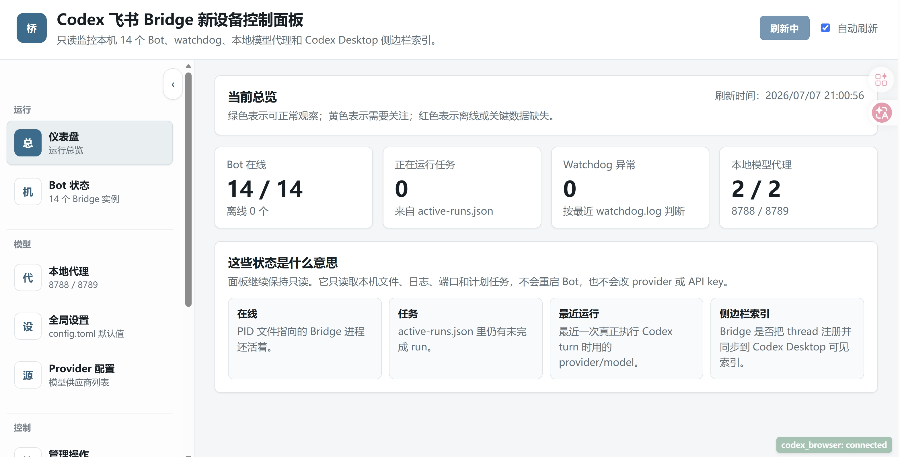
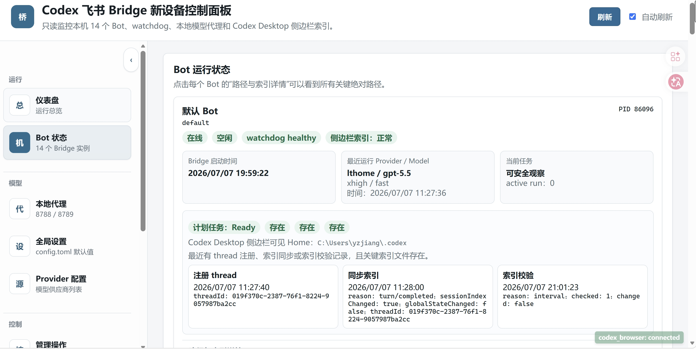
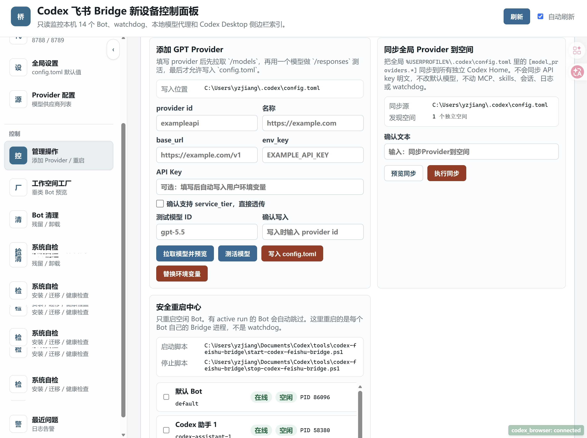

# Codex 飞书 Bridge

把飞书 Bot 接到本机 Codex 的 Windows Bridge。它负责接收飞书消息、下载附件、调用本机 `codex app-server`、把进度和结果回写到飞书，并提供一个本地控制面板管理 Bot、Provider、工作空间和运行状态。

> 当前项目面向个人本机部署和多 Bot 工作流，不是云端托管服务。仓库只保存代码、脚本、示例配置和公开文档；真实密钥、飞书 profile、运行日志、二维码、会话状态和本机实例配置不会提交。

Windows 用户可以从 GitHub Releases 下载 `Codex Feishu Bridge Setup.exe`。客户端内置 Node.js、lark-cli 和 Bridge 引擎；`v0.2.0` 之后的安装版通过“系统 -> 客户端更新”检查 GitHub 稳定发行版，后台下载，并在没有活动任务时重启安装。

## 界面预览

控制面板把多 Bot、watchdog、本地模型代理、Provider 和工作空间管理集中到一个本机网页里。



每个 Bot 都可以单独查看 PID、active run、watchdog、最近运行模型和 Codex Desktop 侧边栏索引状态。



Provider 添加、测试、环境变量替换、同步到空间 Codex Home 和空闲 Bot 重启都在同一个安全操作区完成。



飞书对话卡片展示 Codex 任务进度、工具调用折叠和最终结果，长任务结束后只保留最近 20 个调用明细。


## 核心能力

- 飞书消息到本机 Codex：支持普通对话、继续当前线程、附件输入、图片/文件下载。
- 多 Bot 实例：每个 Bot 独立飞书 profile、运行目录、日志、workspace、watchdog。
- 会话命令：`/help`、`/list`、`/switch`、`/new`、`/delete`、`/confirm delete`、`/rename` 等。
- 安全删除：先按 `/list` 序号生成 threadId 快照，二次确认后清理 Codex DB、rollout、索引、侧边栏状态和 Bridge 绑定。
- 垂类空间：支持写作、百科、画图等空间 Bot，共用或独立 Codex Home；不同 Codex Home 的会话严格隔离，不再镜像到全局侧边栏。
- 控制面板：查看进程、日志、Provider、MCP、工作空间工厂、Bot 卸载和空间卸载。
- 自动注册辅助：生成飞书 Bot、写入 lark-cli profile、校验 scopes、安装 watchdog、启动实例。
- Provider 同步：从全局 Codex 配置同步可枚举 provider 到空间 Codex Home，密钥走环境变量。
- Windows watchdog：通过计划任务维持 Bridge、控制面板和可选本地代理进程。

## 工作方式

```text
飞书用户
  -> 飞书 Bot / lark-cli 事件
  -> codex-feishu-bridge.mjs
  -> codex app-server --listen stdio://
  -> 本机 Codex Home / workspace / sessions
  -> Bridge 回写飞书卡片和文本
```

每个 Bot 都是独立进程，但共用本仓库里的同一套 Bridge 代码。改 Bridge 源码后，已运行的 Bot 需要重启对应进程才会加载新代码。

普通对话会让飞书卡片创建和 Codex 启动并行进行。初始化后的 app-server 使用独占租约保留一段空闲时间，后续热会话跳过重复进程启动和 `initialize`；同一个 stdio 客户端不会同时交给两个任务。默认热保留 15 分钟、池大小跟随消息并发数，也可以通过 `.env.example` 中的性能环境变量调整或恢复为每次冷启动。

Bridge 启动时还会建立事件时间水位线。超过重启宽限窗口的积压旧消息会被持久化标记并跳过，避免客户端升级或 Bot 重启后突然回复历史内容。

## 环境要求

- Windows 10/11
- Node.js 20+
- 已安装并可运行的 Codex CLI / Codex Desktop 对应 `codex.exe`
- 已安装并登录的 `lark-cli`
- 一个可用的飞书开放平台应用，或使用本项目的注册脚本辅助创建
- PowerShell 5.1 或 PowerShell 7

安装依赖：

```powershell
npm install
```

语法检查：

```powershell
npm run check
```

## 配置

公开仓库里的 `bridge.instances.json` 是示例配置。真实设备请复制为本地配置：

```powershell
Copy-Item .\bridge.instances.json .\bridge.instances.local.json
```

然后修改 `bridge.instances.local.json` 里的本机路径、Bot 名、飞书 profile、workspace、Codex Home 和计划任务名。这个文件已被 `.gitignore` 忽略，不会提交。

控制面板加载顺序：

1. 环境变量 `CODEX_FEISHU_INSTANCES_CONFIG` 指向的文件
2. 仓库根目录 `bridge.instances.local.json`
3. 仓库根目录 `bridge.instances.json`
4. 内置 fallback 配置

## 启动一个 Bot

示例：

```powershell
powershell.exe -NoProfile -File .\start-codex-feishu-bridge.ps1 `
  -Name codex-assistant-1 `
  -LarkProfile codex-assistant-1 `
  -Workspace "$env:USERPROFILE\Documents\Codex\workspaces\feishu-bridge-codex-assistant-1" `
  -CodexHome "$env:USERPROFILE\.codex"
```

停止：

```powershell
powershell.exe -NoProfile -File .\stop-codex-feishu-bridge.ps1 -Name codex-assistant-1
```

安装 watchdog：

```powershell
powershell.exe -NoProfile -File .\install-codex-feishu-watchdog.ps1 `
  -Name codex-assistant-1 `
  -LarkProfile codex-assistant-1 `
  -Workspace "$env:USERPROFILE\Documents\Codex\workspaces\feishu-bridge-codex-assistant-1" `
  -CodexHome "$env:USERPROFILE\.codex"
```

## 控制面板

启动：

```powershell
npm run panel
```

默认地址：

```text
http://127.0.0.1:8320/
```

控制面板可以做这些事：

- 查看每个 Bot 的 PID、watchdog、日志、active run、最近错误。
- 新建垂类工作空间和 Bot 注册队列。
- 展示注册二维码、补授权二维码和每个 job 的当前状态。
- 写入实例配置、安装 watchdog、启动 Bot。
- 添加 Provider、写入用户环境变量、同步 Provider 到空间。
- 卸载垂类 Bot、清理未完成注册残留、卸载整个空间。

## 飞书侧命令

常用命令：

```text
/help
/list
/switch 3
/new
/rename 新标题
/steer 补充当前任务遗漏的要求
/delete 2
/delete 2 4-6
/confirm delete 1
/provider list
```

`/list` 会合并当前 Bot 绑定、同一 Codex Home 的其他 Bot 绑定、Codex DB、rollout 文件、`session_index.jsonl` 和 `.codex-global-state.json`，并标注来源；不会列出其他 Codex Home 的会话。`/delete` 只生成待删除快照，`/confirm delete` 才真正按 threadId 清理当前 Home 和同 Home Bridge 绑定，避免列表顺序变化造成误删或跨空间删除。

`/steer <补充内容>` 会把新要求追加到当前正在运行的 Codex turn，不进入普通消息队列，也不会创建新任务。当前没有可追加的原生 app-server turn 时，命令会明确拒绝且不执行降级操作。

## 文档

- [个人环境迁移](docs/personal-environment-migration.md)
- [架构说明](docs/architecture.md)
- [控制面板](docs/control-panel.md)
- [工作空间工厂](docs/workspace-factory.md)
- [配置与安全边界](docs/configuration-and-security.md)
- [故障排查](docs/troubleshooting.md)
- [极致响应改造规划](docs/bridge-performance-plan.md)
- [极致响应执行记录](docs/bridge-performance-execution.md)

## 不会提交的内容

- `.env`、密钥、token、飞书 app secret、API key
- `.lark-cli/`、`.codex/`、真实 `config.toml`
- `bridge.instances.local.json`
- runtime state、日志、PID、二维码、授权页面
- Codex 会话数据库、rollout、附件和 workspace 真实内容

## 许可证

MIT License。详见 [LICENSE](LICENSE)。
