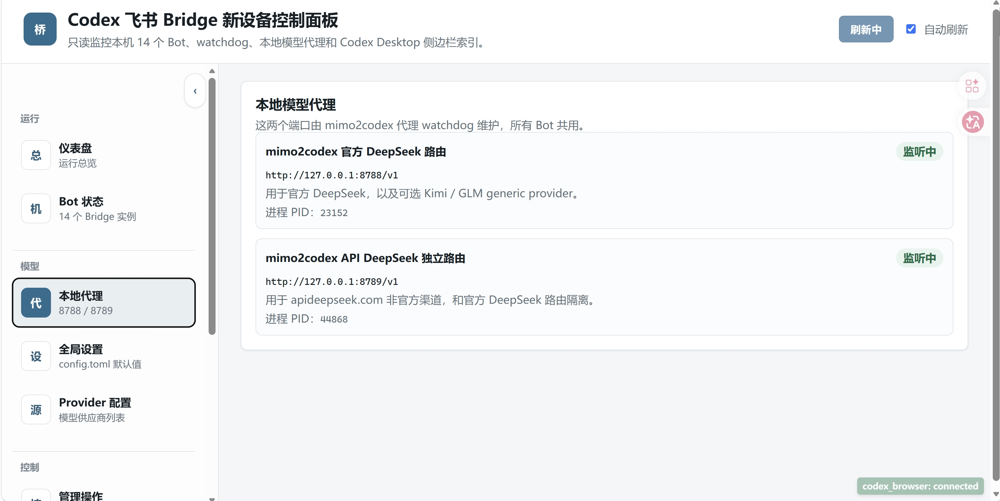
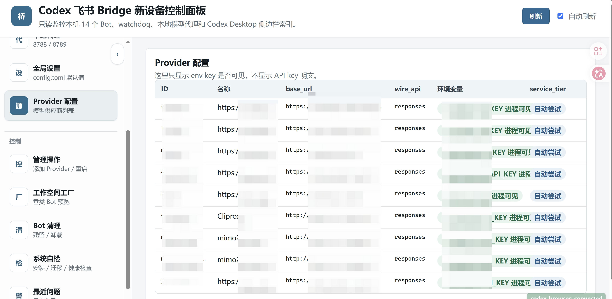

# 控制面板

控制面板是本机可视化入口，默认运行在 `http://127.0.0.1:8320/`。它读取 Bridge 运行状态、日志、注册队列和配置文件，把原本分散在 PowerShell、日志和 JSON 文件里的信息整理成网页。


## 启动

```powershell
npm run panel
```

或：

```powershell
powershell.exe -NoProfile -File .\start-control-panel.ps1
```

## 主要页面

- 总览：Bot 实例、PID、watchdog、日志、active run、最近错误。
- Provider：添加 OpenAI-compatible provider、测试模型、写入用户环境变量、同步到空间 Codex Home。
- 工作空间工厂：生成垂类 Bot 队列、注册飞书 APP/profile、展示二维码、校验 scopes、写入实例配置、安装 watchdog、启动 Bot。
- 卸载与清理：清理未完成注册残留、卸载垂类 Bot、卸载整个空间。
- 日志：聚合最近 WARN / ERROR / failed / 502 等关键日志。






## 实例配置

控制面板读取 `bridge.instances.local.json` 时会看到真实 Bot。公开仓库的 `bridge.instances.json` 只是示例，不建议直接承载本机真实配置。

如果要指定其他配置文件：

```powershell
$env:CODEX_FEISHU_INSTANCES_CONFIG = 'D:\my-private-bridge.instances.json'
npm run panel
```

## 动态刷新

面板通过 API 周期性读取后端状态，所以进程、日志、队列、Provider 同步计划会随本机状态更新。新增 Bot 后，需要执行“写入实例配置”并刷新页面，面板才会把它纳入实例列表。

## 安全边界

控制面板只管理本机文件和进程。它不会自动删除飞书开放平台里的应用，也不会删除飞书聊天记录。涉及卸载时会检查 active run、路径根目录和确认文本，避免误删核心 Bot 或根目录。
