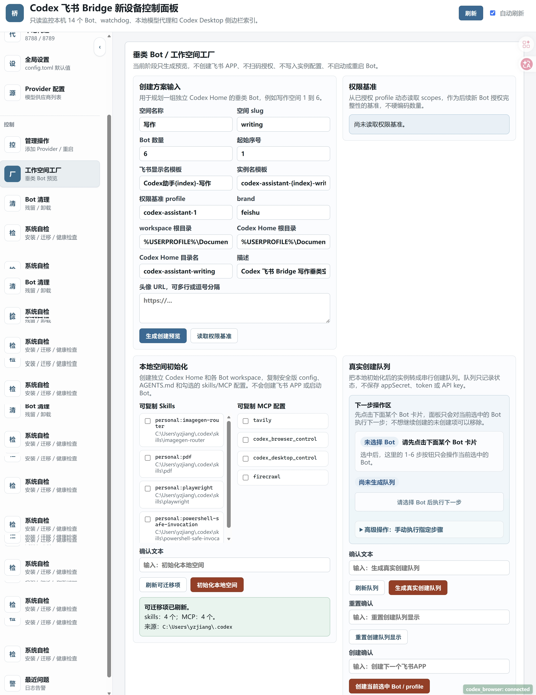

# 工作空间工厂

工作空间工厂用于批量创建垂类 Bot，例如写作 Bot、百科 Bot、画图 Bot。它把过去需要手工执行的创建目录、迁移配置、注册飞书 APP、写入 profile、安装 watchdog、启动 Bridge 串成一个可跟踪队列。



## 推荐流程

1. 在控制面板打开“工作空间工厂”。
2. 填空间名、slug、起始序号、数量、Codex Home 目录名。
3. 选择要从全局迁移的 Skills 和 MCP。
4. 生成本地空间：创建 workspace、Codex Home、`config.toml`、必要目录。
5. 逐个注册 Bot：每个 Bot 都会生成自己的二维码和 profile。
6. 手机飞书扫码授权。
7. 校验 scopes：以基准 profile 的实际 scopes 为准，不硬编码权限列表。
8. 写入实例配置：写入 `bridge.instances.local.json`。
9. 安装 watchdog。
10. 启动 Bot。

## 并行与顺序

创建队列可以一次生成多个 Bot。实际扫码、补授权、写入和启动可以按单个 Bot 操作，不要求必须从第一个做到最后一个。每个 job 都应该显示自己的名称、profile、二维码、日志和当前状态。

## 空间 Codex Home

垂类空间建议使用独立 Codex Home，例如：

```text
C:\Users\<you>\Documents\Codex\codex-homes\codex-assistant-writing
```

这样空间 Bot 的配置、Skills、MCP 和会话状态不会直接污染全局 `.codex`。如果配置了 `desktopCodexHome`，空间会话可以镜像到全局桌面侧边栏，删除时也会同步清理镜像。

## Provider 同步

Provider 以全局 `config.toml` 为源。同步时只复制可公开配置块，例如 provider name、base_url、wire_api、env_key。实际 API key 通过 Windows 用户环境变量读取，不写入空间 `config.toml`。

## 卸载

卸载垂类 Bot 会清理本机 Bridge runtime、registration 记录、可选 workspace，并从本地实例配置移除。卸载整个空间会处理该 group 下的正式 Bot、残留 job 和可选 Codex Home。飞书开放平台应用需要用户在飞书后台自行删除。
